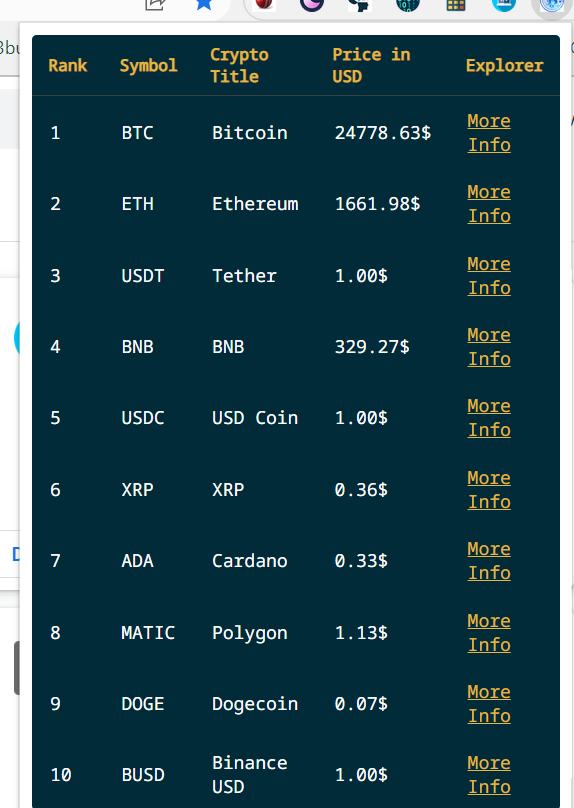

# **Crypto Currency Extension**

This Extension will showcase the status of all the Crypto Currencies based on their symbol and Price in USD. This extension would also give More Information on specific Crypto Currencies selected by user.

## Technologies used:
- HTML
- CSS
- JavaScript

### This Extension will showcase the status of all the Crypto Currencies based on their symbol and Price in USD. This extension would also give More Information on specific Crypto Currencies selected by user.

### In this extension I used API to fetch data about the Crypto Currencies

---

## Screenshots

## screenshot of Extension
