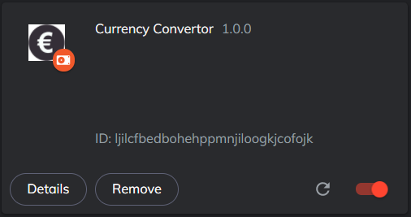
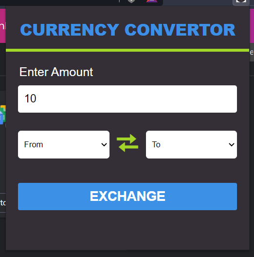

<h1 align="center"> CURRENCY CONVERTOR </h1>

<!-- ---------------------------------------------------------------------------------------------------------------------- -->

    
Currency Convertor converts the desired currency into another desired currency.
  
  

  <!-- ---------------------------------------------------------------------------------------------------------------------- -->

 

 #### Tech-Stack used :

  
  
  

 
 <!-- ---------------------------------------------------------------------------------------------------------------------- -->

## Output :

 

### Step 1st :
First you have to enable this extension ,

  

 

 

### Step 2nd :
In the first input box enter the amount to be converted, after that select the initial currency type (From) and then select the final currency type (To)  
And now click on "EXCHANGE" Button, and amount entered will be converted in to desired currency.

  

## Demo Video :

    
https://user-images.githubusercontent.com/87393095/162266278-71d78102-3746-453b-b00c-89ef9b643bf5.mp4

 

 
