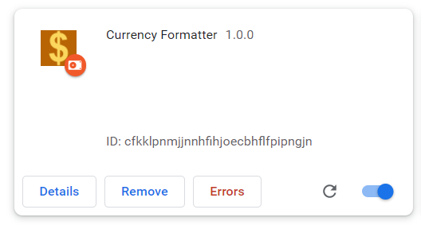
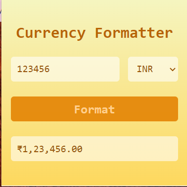

# **Format Currency Extension**
This extension will format numerical value into International Currency Number System.
## Technologies used:
* HTML
* CSS
* JavaScript

### Step 1- open chrome/browser and go to extensions. Unpack Formate Currency Extension.

### step 2- enter a number/amount and select formatting type.

### step 3- press format button and see the output on result box.

