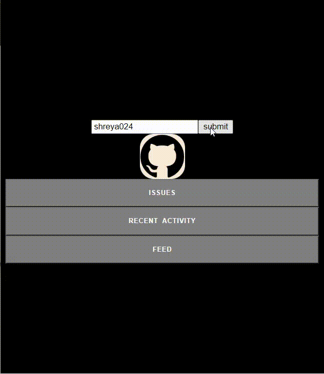

# **The Github Extension**

This Extension will showcase the status of feed, issues and recent activity of a Github User.

## Technologies used:

- HTML
- CSS
- JavaScript

### This Extension will showcase the status of feed, issues and recent activity when provided with the Github username as input. This will make the life of any github user easier as they can readily check their recent github developments.

### In this extension I used Github REST API to fetch data when the submit button is clicked it will fetch the user data and and is visible on our screen using html,css and javascript.This extension provides options of a current/upcoming activity.

---

## Screenshots

## Simulation Video

