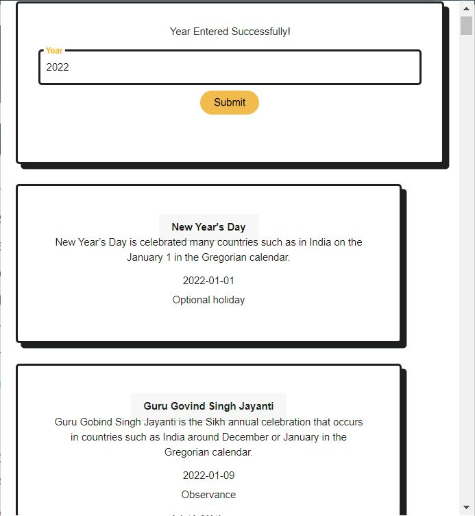
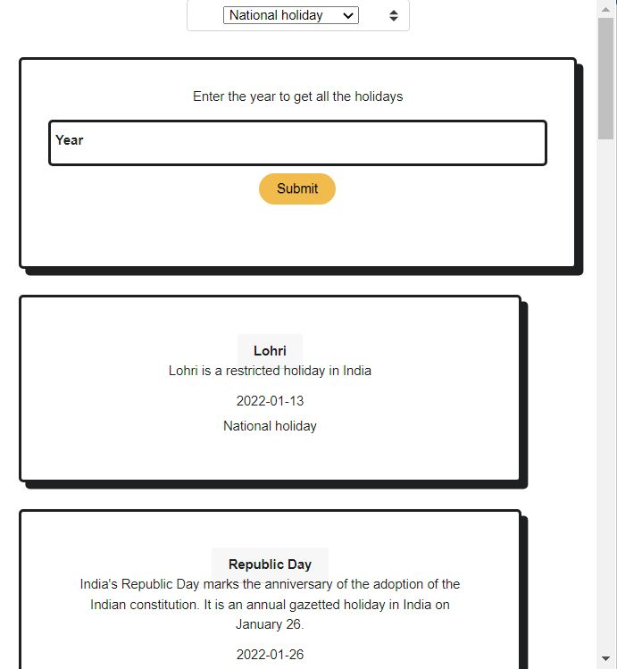

# **Holiday Extension**

This extension HAS all dates and days of holidays.

## Technologies used:

- HTML
- CSS
- JavaScript

### This extension will have all dates and days of holidays of a given year.It has a search option for holidays with the option for national, optional and observance holidays.

### In this extension I used the calendarific API to fetch the holidays data.It renders the data sfter the user enters a year and is visible on our screen using html,css and javascript.

---

## Screenshots

## Simulation Video

