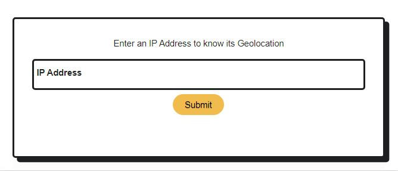
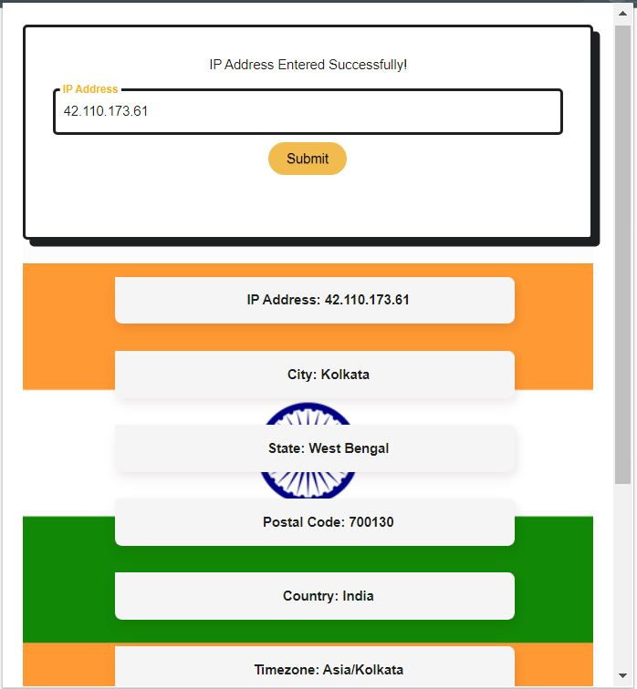

# **IP Geolocation Extension**

This extension can be used to get the location of any IP Address.

## Technologies used:

- HTML
- CSS
- JavaScript
- Abstract IP Geolocation API

### The IP Geolocation allows you to look up the location, timezone, country details, and more of an IPv4 or IPv6 address.

### In this extension I used the abstract IP geolocation api to fetch data when the submit button is clicked after entering the IP address. It will fetch the detailed location and is visible on our screen using html,css and javascript.

---

## Screenshots

## Simulation Video

