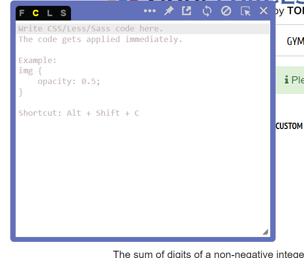

# **Live CSS Extension**

This extension would provide a Live CSS Editor that would give users and developers an option to directly modify the styling, CSS of the whole webpage and see a live output.
Since this is a utility extension, it would add a lot of helpful and ease to the developers

## Technologies used:
- CSS
- JavaScript

### This extension would provide a Live CSS Editor that would give users and developers an option to directly modify the styling, CSS of the whole webpage and see a live output.

## Video Demonstration
https://user-images.githubusercontent.com/72455881/170840064-6fde2d1d-3fbb-46bf-83c3-632830fcd6c4.mp4

## Screenshots

## updated Live css editor

  