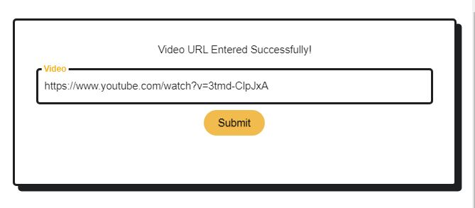
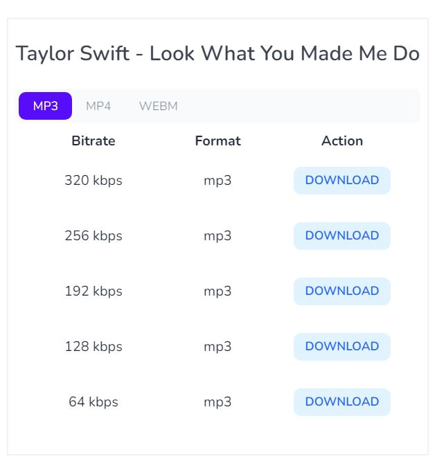
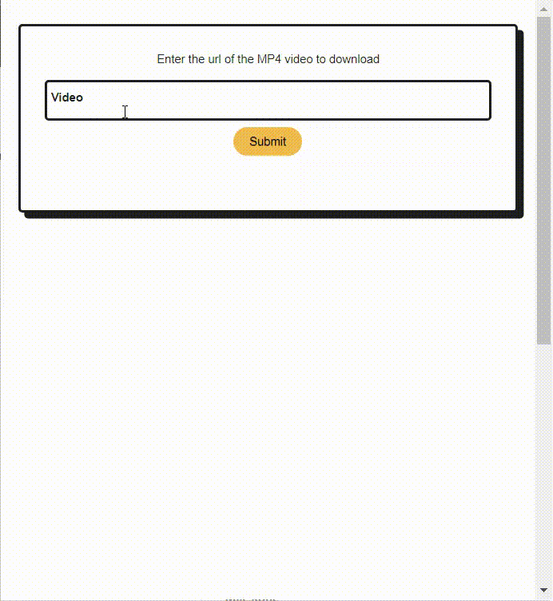

# **MP4 to MP3 Video Converter**

This extension can be used for the converting mp4 to mp3 format.

## Technologies used:

- HTML
- CSS
- JavaScript

### This extension will convert any Youtube,SoundCloud,Twitter,Instagram video(mp4) to mp3 format.

### In this extension I used the yt-download.org api to make the extension.It renders a list of mp3 formats to download from on entering a legit mp4 video url and is visible on our screen using html,css and javascript.

---

## Screenshots

## Simulation Video

