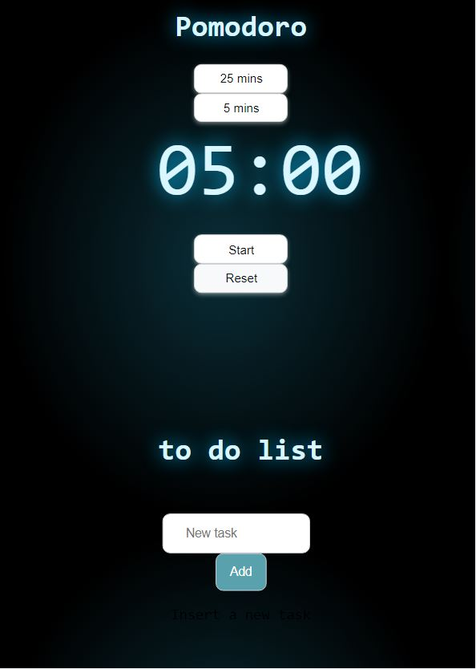
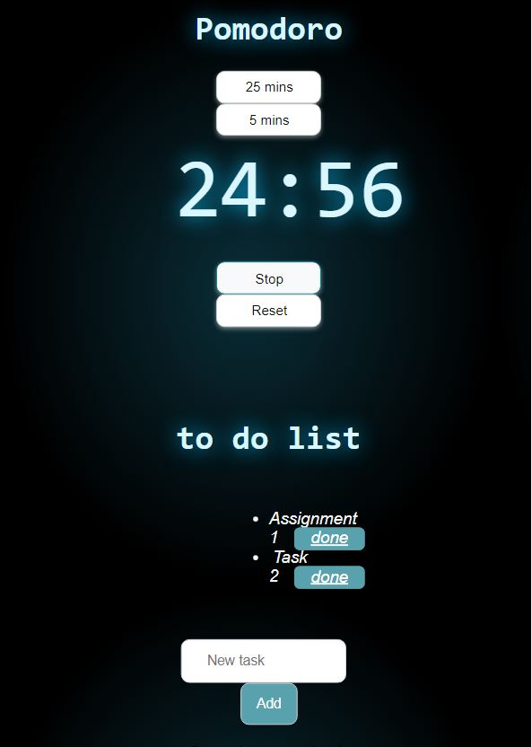

# **Pomodoro Extension**

This extension can be used for the Pomodoro productivity technique.

## Technologies used:

- HTML
- CSS
- JavaScript

### This extension enables to Add/remove tasks to work on ,start timer and focus on the task for 25 minutes or take a five minutes break.

### In this extension I used the local Storage to fetch the tasks data so that no information is lost.It starts the timer on selecting the option of 25 mins/5 mins and is visible on our screen using html,css and javascript.

---

## Screenshots

## Simulation Video

