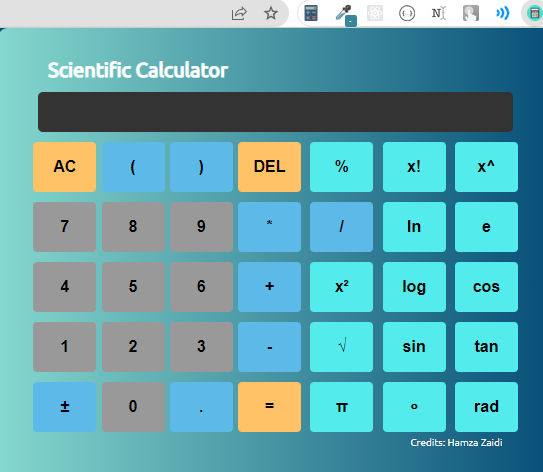

<h1 align="center"> Scientific Calculator Chrome Extension</h1>

# Introduction

Hi! I have made Scientific Calculator which is very helpful some times. If you want to calculate on chrome than this calculator in your extension is useful you can use it anytime!

# Description

The project is for the educational purpose that if u want your extension to show up on chrome tool bar than u can make it too!

# How to create google chrome extension

**Blog : [`Read More =>`](https://levelup.gitconnected.com/make-your-first-chrome-extension-with-javascript-7aa383db2b03)**

# ScreenShot



# Installation

- Clone this project:
```
git clone https://github.com/HamzaZaidiX/Scientific-Calculator-Chrome-Extension
```
- Go to Chrome Extension Webstore
- Go to Extention manager `chrome://extensions/` in chrome
- Load the folder into the chrome

-  **BOOM! YOU ARE NOW LIVE**

# Licence

MIT LICENCE
Read `Licence` document for more details

# Bye! 👋

HOPE U LIKE THIS PROJECT PLEASE! IF YOU ARE USING THIS CODE PLEASE GIVE **HAMZA ZAIDI** SOME CREDITS BY LIKE & GIVE A HEART!!! 😃👍💛
