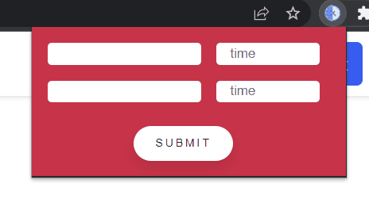

# Timezoneee

Timezoneee is a Google Chrome Extentsion to compare and convert time instantly to all the major time zones across the world.

# Installation

- Clone this project `git clone ` or Download ZIP and find the Timezoneee Folder
- Go to Manage Extenions in Chrome (chrome://extensions/)
- Load the extension into the Chrome

# Usage

- Select source and destination timezones from the dropdown
- Submit

## Example
***

*** 
  
made by - [@r3yc0n1c](https://github.com/r3yc0n1c) @ JWoC'22