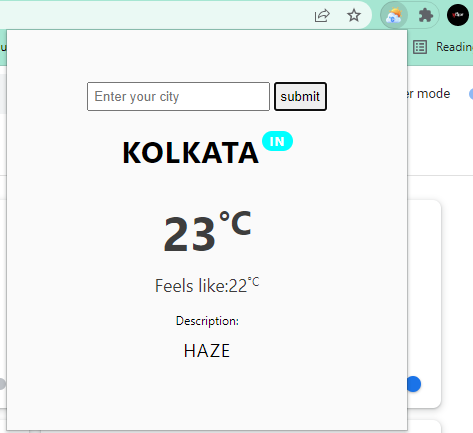
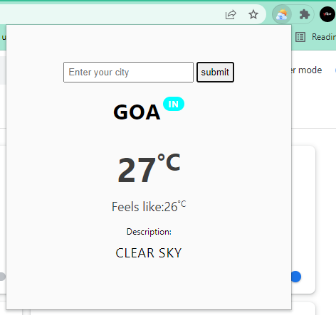

## Weather App Extension
 

<h2 align="center">Extension preview</h2>
 

 
<h2 align="center">Description</h2>

 This is a weather app where you can search any city to view the current weather status of that city. The weather information includes:

-  Current city
-  Country code
-  Temperature in celcius scale
-  Temperature that feels like (in celcius)
-  Current weather description

 
 

- <h3>Made by <a href="https://github.com/Srijita-Mandal">Srijita Mandal</a></h3>

