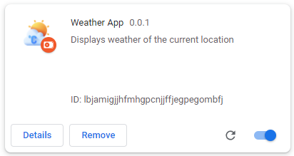
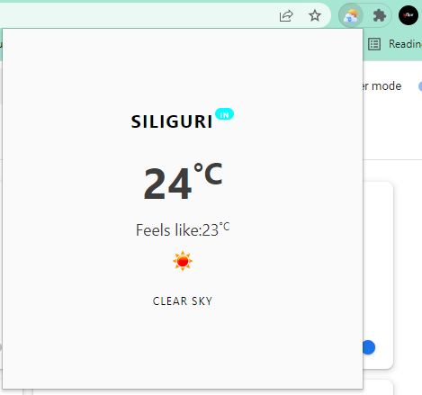

## Weather App Extension
 

<h2 align="center">Extension preview</h2>
 

 
<h2 align="center">Description</h2>

 This is an weather app which takes the current user location and displays the weather of that place. The weather information includes:

-  Current city
-  Country code
-  Temperature in celcius scale
-  Temperature that feels like (in celcius)
-  Icon for the weather status
-  Current weather status

 
 

- <h3>Made by <a href="https://github.com/Srijita-Mandal">Srijita Mandal</a></h3>

